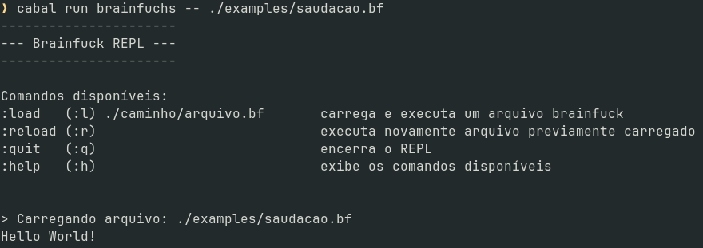
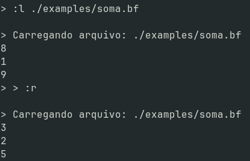
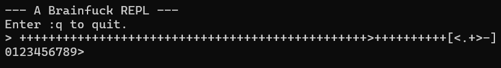
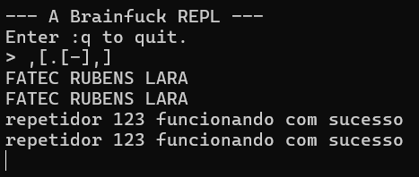
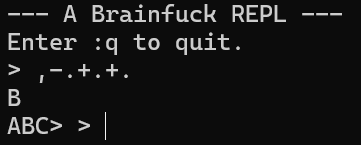
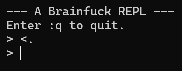
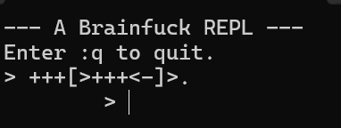
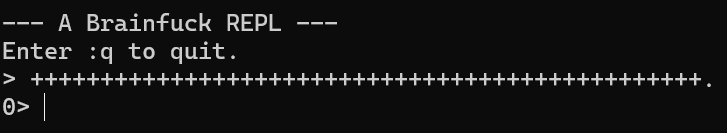

# Exemplos de Programas em Brainfuck - 08/10/25

Este diretório contém programas de exemplo para testar o interpretador **BrainfucHS**.
Cada programa demonstra funcionalidades básicas da linguagem Brainfuck e valida o funcionamento do interpretador.

---

## 🔹 Programas

### 1. `saudacao.bf`
Imprime a frase **"Hello World!"** no terminal.

- **Propósito**: programa introdutório, usado para verificar se o interpretador funciona corretamente.
- **Código comentado**:
```brainfuck
++++++++++                              // Célula 0 = 10 (contador para o loop de inicialização)

[                                       // Início do loop de inicialização
  >+++++++                              // Célula 1 += 7  (será base para 'H')
  >++++++++++                           // Célula 2 += 10 (será base para 'e' e 'l')
  >+++                                  // Célula 3 += 3  (será base para 'l', 'o', ' ')
  >+                                    // Célula 4 += 1  (será base para 'W', 'o', 'r', 'l', 'd', '!')
  <<<<-                                 // Volta para célula 0 e decrementa
]                                       // Repete até célula 0 = 0

>++.                                    // Célula 1: 7×10=70 → ++ → 72 ('H')
>+.                                     // Célula 2: 10×10=100 → + → 101 ('e')
+++++++.                                // Célula 2: +7 → 108 ('l')
.                                       // Célula 2: imprime novamente → 108 ('l')
+++.                                    // Célula 2: +3 → 111 ('o')
>++.                                    // Célula 3: 3×10=30 → +2 → 32 (' ') espaço
<<+++++++++++++++.                      // Célula 1: 72+15=87 → imprime 'W'
>.                                      // Célula 2: 101 → imprime 'o'
+++.                                    // Célula 2: +3 → 114 ('r')
------.                                 // Célula 2: -6 → 108 ('l')
--------.                               // Célula 2: -8 → 100 ('d')
>+.                                     // Célula 3: 32+1=33 → '!'
>.                                      // Célula 4: move e finaliza
```

**Saída:**



### 2. `soma.bf`
Lê dois números (0–9) digitados pelo usuário e imprime a soma.

- **Propósito**: demonstrar o uso de entrada (,) e operações aritméticas.
- **Código comentado**:
```brainfuck
,                         // Lê o primeiro número do usuário
>++++++[<-------->-]      // Ajusta valor de ASCII para número
,                         // Lê o segundo número
[<+>-]                     // Soma o segundo número ao primeiro
<.                        // Imprime o resultado
```

**Saída:**



### 3. `contador.bf`
Imprime a sequência de números de 0 até 9.

- **Propósito**: demonstrar loops e manipulação de células.
- **Código comentado**:
```brainfuck
++++++++++++++++++++++++++++++++++++++++++++++++   // Célula 0 = 48 (código ASCII de '0')
>++++++++++                                       // Célula 1 = 10 (quantidade de números a imprimir)
[                                                // Início do loop
  <                                              // Volta para célula 0
  .                                              // Imprime o caractere atual (inicia em '0')
  +                                              // Incrementa célula 0 (próximo dígito ASCII)
  >                                              // Vai para célula 1
  -                                              // Decrementa contador
]                                                // Repete até célula 1 = 0
```

**Saída:**



### 4. `repetidor.bf`
Repete tudo que o usuário digitar, até o fim da entrada.

- **Propósito**: demonstrar entrada contínua e saída imediata.
- **Código comentado**:
```brainfuck
,                         // Lê um caractere do usuário
[                         // Enquanto o caractere não for zero
  .                       // Imprime o caractere
  [-]                     // Zera a célula atual
  ,                       // Lê o próximo caractere
]                         // Repete até fim da entrada

```

**Saída:**



### 5. `antesuc.bf`
Imprime o caractere **anterior**, **o próprio caractere** e o **sucessor**.

- **Propósito**: demonstrar manipulação de células e operações aritméticas simples.
- **Código comentado**:
```brainfuck
,       // Lê um caractere digitado pelo usuário e armazena na célula atual
-       // Decrementa a célula (ASCII do caractere - 1), para imprimir o anterior
.       // Imprime o caractere anterior
+       // Incrementa a célula para voltar ao caractere original
.       // Imprime o próprio caractere
+       // Incrementa a célula novamente (ASCII + 1) para imprimir o sucessor
.       // Imprime o caractere sucessor
```

**Saída:**



### 6. `moveponteiro.bf`
Move o ponteiro para antes de qualquer célula.

- **Propósito**: demonstrar manipulação de ponteiro.
- **Código comentado**:
```brainfuck
<   // Move o ponteiro para a célula à esquerda
.   // Imprime o valor da célula atual (pode ser 0 ou ASCII definido previamente)
```

**Saída:**



### 7. `tab.bf`
Imprime um TAB.

- **Propósito**: demonstrar manipulação de valores e impressão de caracteres especiais.
- **Código comentado**:
```brainfuck
+++          // Inicializa célula 0 com valor 3 (contador para o loop)
[            // Início do loop
  >+++       // Incrementa célula 1 em 3
  <-         // Volta para célula 0 e decrementa
]            // Fim do loop (repete 3 vezes)
>.           // Move para célula 1 e imprime o valor correspondente a um TAB (ASCII 9)
```

**Saída:**



### 8. `zero.bf`
Imprime o número zero.

- **Propósito**: demonstrar inicialização de célula e impressão de um caractere específico.
- **Código comentado**:
```brainfuck
++++++++++++++++++++++++++++++++++++++++++++++++.
// Incrementa célula 0 48 vezes (ASCII de '0') e imprime
```

**Saída:**




