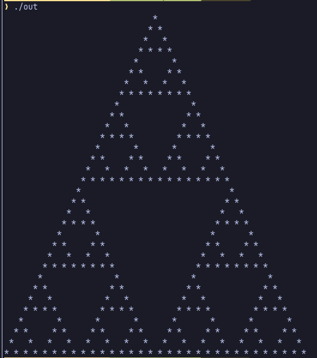
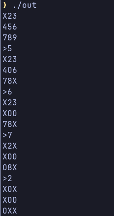

# Exemplos de Programas em Brainfuck

Os códigos apresentados aqui foram implementados por Daniel B. Cristofani, criador do site [brainfuck.org](https://brainfuck.org/).

Todos os arquivos de exemplo podem ser executados também pelo interpretador usando `cabal run brainfuchs -- ./examples/nome-do-arquivo.bf`

## Particle Automaton

> Você fornece uma configuração inicial, então pressiona ENTER repetidamente para avançar um passo a cada vez.
> Manter ENTER pressionado pode ser, ou não, insatisfatoriamente rápido, dependendo da escolha do padrão.

- Exemplo de configuração inicial:

```
      /\
     /\ \
    /  \ \
   / /\ \ \
   \ \^ / /
    \ \/ /
     \  /
      \/
```

- Compilar e executar:

```bash
cabal run bfhsc -- ./examples/bounce.bf out

./out
```

Quando o programa iniciar, colar o exemplo de configuração inicial e apertar enter repetidamente:


Para outros exemplos de configuração e mais detalhes sobre a implementação, veja o [código comentado](../bounce.bf).

## Sierpinsky

> Exibe uma representação ASCII do triângulo de Sierpinski (iteração 5).

```bash
cabal run bfhsc -- ./examples/sierpinsky.bf out

./out
```

- Saída:



- [Código comentado](../sierpinsky.bf)

## Jogo da Velha

> No prompt >, digite o número de um espaço vazio e pressione Enter para fazer sua jogada naquele quadrado.

```bash
cabal run bfhsc -- ./examples/tictactoe.bf out

./out
```

- Saída:



- [Código comentado](../tictactoe.bf)

## Fonte

No site [brainfuck.org](https://brainfuck.org/) você encontra vários outros exemplos interessantes.
